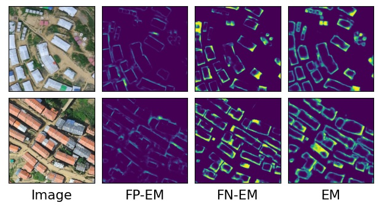

# Dense prediction of label noise for learning building extraction from aerial drone imagery

Demo notebook on Google Colab: https://colab.research.google.com/drive/16aKbTAR-_u6NYu0ZSqxDHQ5loexwys7i

Models
* (C)lean (L)abel model : CL-model.h5
* (N)oisy (L)abel model : NL-model.h5
* (I)ntermediate (E)rror (M)atrix model : I-EM-model.h5
* (I)ntermediate (F)alse (P)ositive (F)alse (N)egative (E)rror (M)atrix model : I-FPFN-EM-model.h5
* (E)rror (M)atrix model : EM-model.h5
* (F)alse (P)ositive (E)rror (M)atrix model : FP-EM-model.h5
* (F)alse (N)egative (E)rror (M)atrix model : FN-EM-model.h5

Please cite the following publication if you are using these models and/or data in your work

Ahmed, N., Rahman, R. M., Adnan, M. S. G., & Ahmed, B. (2021). Dense prediction of label noise for learning building extraction from aerial drone imagery. International Journal of Remote Sensing, 1-24. https://doi.org/10.1080/01431161.2021.1973685

BibTex reference 

@article{ahmed2021dense,
  title={Dense prediction of label noise for learning building extraction from aerial drone imagery},
  author={Ahmed, Nahian and Rahman, Rashedur M and Adnan, Mohammed Sarfaraz Gani and Ahmed, Bayes},
  journal={International Journal of Remote Sensing},
  pages={1--24},
  year={2021},
  publisher={Taylor \& Francis}
}
